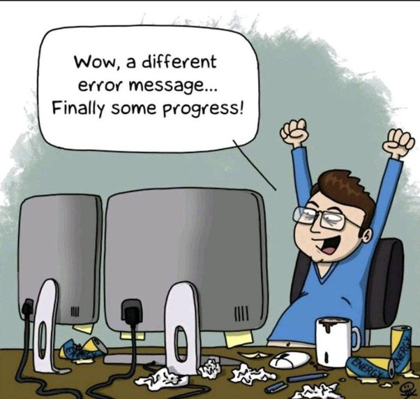

Software development is a skill which requires expertise in a large variety of areas. In my software development course, we have learned a great many tools, from a new coding language, development environments, and coding standards, to ethics, project management, and even quality assurance tools. 

There were many valuable lessons taught in my software development course, culminating in [this awesome app](https://sienner.github.io/projects/RainbowGallery.html). We learned how to iteratively design web applications in a flexible manner, using Agile Project Management principals. Specifically, we used the Issue Driven Project Management, [IDPM](https://courses.ics.hawaii.edu/ics314f23/morea/project-management/reading-guidelines-idpm.html) guidelines to effectively collaborate and build an application as a group. We studied [design patterns](https://sienner.github.io/essays/tessellation-for-creation.html) through practical implementations in many different aspects of the course. We built a great toolset, including [React.js](https://react.dev), [Bootstrap](https://sienner.github.io/essays/pull-up-by-bootstrap.html), and [Meteor.js](https://www.meteor.com). 

Throughout the course, we built many important skills. Building the foundations for success in the Software Development world, we learned through applying knowledge, undoubtedly the most practical way. Although many of the things we learned received direct instruction, the most valuable lessons learned were not from course instruction at all. 

## Filling in the Pieces  

Instruction in a course often offers valuable insight into vital materials. However, true learning occurs through synthesis. In every course, the most rewarding learning experience comes from trying to get something to work and finding the missing piece (or pieces!) on your own. Especially in a field like Software Development, it is impossible for an instructor to cover *all* the necessary information and possibilities. More likely than not, you will come across a block not covered in course material or instructional content. 

This is by far the most important experience you can receive from any class. Needing a piece of information and being able to seek it out effectively and efficiently is the cornerstone of an effective individual. Although finding an error and not knowing how to fix it may be extremely frustrating, once you understand the reason you've been sitting there for a while without progress, you are *highly* unlikely to ever forget that lesson! Troubleshooting and finding the filling in the pieces is a vital skill in the Computer Science field. Effectively finding, comprehending, and then fixing an error or missing piece of information is the most valuable lesson of all!

## Project Management

Productive project management is an especially important capability for software developers, or anyone taking on any project! For our final project in this course, we were tasked to create an app that solves some problem that University of Hawaii at Manoa students may have. We worked in groups of approximately four to create an app almost entirely from scratch. This is a huge task for four introductory level (college student) developers to complete in approximately 3 weeks, so highly productive project management was key! In order to create an [awesome product](https://sienner.github.io/projects/RainbowGallery.html) in this timeline, we used Agile Project Management, specifically the [IDPM](https://courses.ics.hawaii.edu/ics314f23/morea/project-management/reading-guidelines-idpm.html) guidelines. 

Agile Project Management is a flexible framework for project conduct that focuses on iterative development, collaboration, adaptation, progress transparency, and continuous improvement. As a subset of agile project management, we employed issue driven project management, or IDPM. IDPM contains the same principals that agile project management does, but focuses on specific issues to accomplish. [For example](https://github.com/orgs/rainbows-gallery/projects/4), with our three week final project, we had a GitHub project for each week, and within each GitHub project were a list of issues to resolve by the deadline. Issues were divided as fairly as possible among team members, and progress was regularly checked at meetings up to 4 times per week. 

Agile Project Management and IDPM allowed us to manage a huge task effectively, "eating the elephant one bite at a time", as they say. These principals allowed us not only to create a high-quality product, but to manipulate it effectively based on testing and feedback. IDPM guidelines allowed to focus our attention to the task at hand and ultimately create a better product than we would have without it.

## Development Environments

Can you imagine trying to code a full-scale application in a text editor? My guess is that it would take approximately 30-40x as long, if not more! Development environments are the brush with which we paint. Throughout this course, we have had the ability to go from never having used or having very little experience with environments like IntelliJ or version control like Git/GitHub, to being very proficient with them. 

We got to gain experience with a new, capable IDE called IntelliJ. IntelliJ had a lot of helpful features and tools, which I'm sure I will never stop discovering! It could also run a terminal window within the application. There were some annoying features, such as how it would offer to 'fix' your npm dependencies, but then irreparably break them, but for the most part IntelliJ was an extremely helpful partner in crime! 

Version control is a vital tool in the development/programming world. Especially when adding different functionalities into an application, branching is helpful in that if you break something in the process, you can compare with old versions and fix issues. If many people want to work at the same time, without overwriting each other, or stepping on each other's toes, branching is there to save the day! Merging branches in GitHub is a pretty streamlined and intuitive process, which allows you to combine functionality while maintaining a working platform. 

We also got to use testing environments, such as [TestCafe](https://testcafe.io). We learned how to effectively and thoroughly test code, view results on the GitHub repository, and run different versions of tests depending on environment, such as testing locally or in headless mode. Environments like TestCafe allow you to consider use cases you might not have otherwise and get thorough testing of your application done on every push. Automated testing allows you to ensure your code works as expected without spending hours double checking every time something changes!

