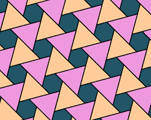
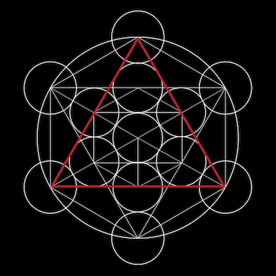
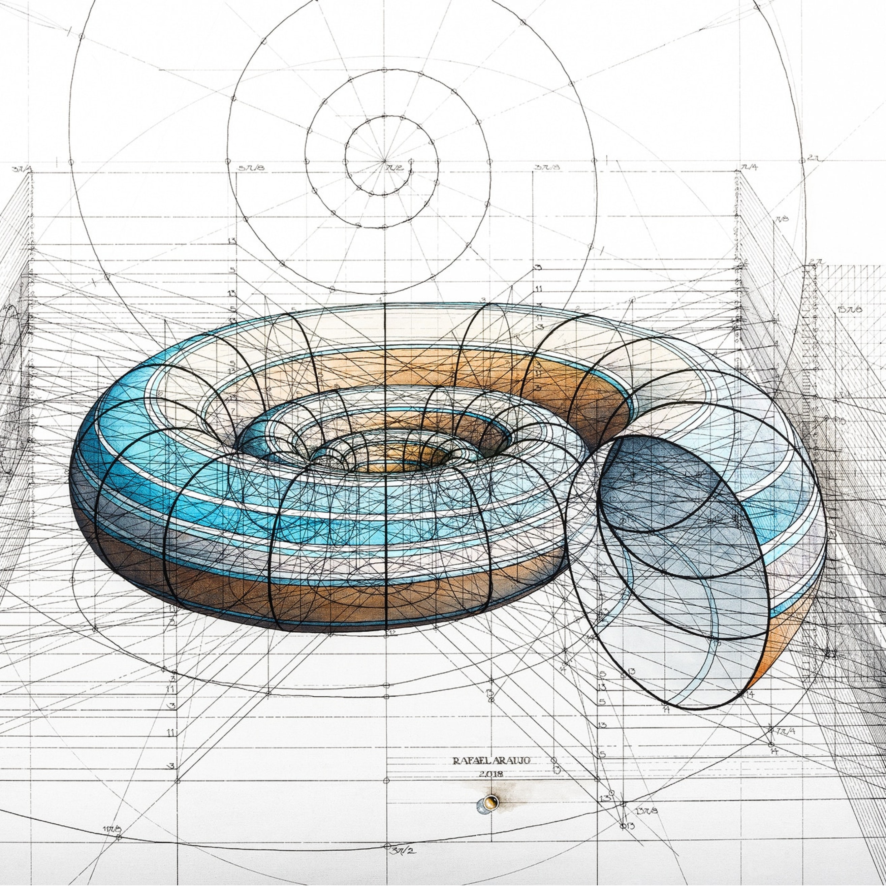

*"To understand is to perceive patterns" - Isaiah Berlin*

Everything in the world is made up of patterns. From behavior to math, science, language, and even nature, everything around us is made up of or can be predicted by patterns. Implementation and understanding of patterns builds the world around us. Patterns affect every aspect of our lives, including software design. 

## Computers and Patterns 

Almost every aspect of computer science is just applied mathematics. And as is well known, math is largely just the discovery and development of naturally occuring patterns. From basic binary to RSA encryption, computers rely heavily on patterns to create and manipulate our every day experiences. Some more examples of computers putting patterns to work are: 

* Algorithms (literally - defined patterns for computer behavior)
* Data Structures (organized patterns for storing information)
* Logic Gates (patterns for computer behavior based on conditions)
* Machine Learning (advanced pattern recognition)
* Graphics (mathematical equations to make patterns look pretty)
* Network Protocols (communication between computers based on patterns)
* Coding Languages (patterns to make other patterns)
* And many more!

Obviously, computers use patterns to perform practically every function. I would be willing to bet, that you could define any process a computer can complete using the word "pattern", or atleast in the context of the word "pattern". Largely because computers are just a cool application of math, you can understand everything just by having a really good understanding of patterns. 

## Software Design Patterns 

## Implementation of Software Design Patterns 

## Patterns Going Forward. 

