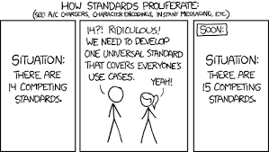
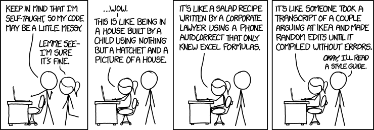

  Growing up, I was always a fan of math and science. I was almost always pretty good at it too! But as all children do, I sometimes would have issues with a particular math assignment here and there. I would get all upset about how in these cases, it didn't just come naturally to me, and I had to get allll worked up over it. My mother, attempting to reassure me that my efforts were not in vain, would always say, "Sienne, math is the universal language. It doesn't matter where you go or what languages they speak there, you will always be able to speak to people in math!". Naturally, I would argue that there are quite a few ideas you cannot get across with math, but the point remains, that there is a great deal of value in standardization and a universally agreed upon set of rules. 

*"You can have brilliant ideas, but if you can't get them across, your ideas won't get you anywhere" - Lee Iacocca*

##  You're Only As Good As Your Communication

You could be the smartest person in the whole world, but it wouldn't matter if other people could not understand you. Likewise, you could write an amazing program, but it would have a limited effect it others could not understand your code, or could not contribute to your work. You might be pretty darn good at coding, but you won't be around forever... 

## Necessity of Coding Standards  

Coding standards are a vital part of the development community. There may be tons of coding languages and a great deal of different coding standards, but the organization and rules which govern a certain coding standard are a vital part to the development of programs and code everywhere. Without coding standards, programs would be considerably more complex, difficult to read, and therefore also a greater challenge to maintain and add upon! Adhering to a set of structural norms allows others to understand what you're trying to do, maintain the goal, and build upon it to create an even more advantageous result. Even if you are more advanced than your peers (or simply under the impression that you are), two brains are practically guaranteed to be better than one. And odds are, there is more than one other person who can understand you if you're using a coding standard! Not only is using a coding standard a vital part of creating code, but it allows you to unleash the power of the nerd community on your work!

## ESLint with IntellijIDEA

In the last week, I have begun working with ESLint and the AirBnB standard set within IntellijIDEA development. The first few times you get an error because you've got an extra space or maybe you're missing a space, it's quite annoying. But that quickly passes, and it becomes habit to write that way in less than 100 lines of code, or in my case, 57 lines. Point being, it is not a colossal inconvenience to adapt a coding standard into your writing. 

Coding standards can actually help you learn a new language more quickly! It's well organized, you know what to expect, and you get a feel for the structure of the writing. If you google code examples for a certain language or problem, you could see 100 different versions of the same code. With a coding standard, that number quickly reduces, and it allows you to focus on the actual language, not the *accent* people speak it with. To extend this metaphor further, sometimes a strong enough accent can make a language incomprehensible. 

In a classroom setting specifically, a coding standard can greatly benefit the student. Now when an instructor reads your code, it will be considerably easier for them to quickly and efficiently recognize any errors which exist. They don't need to spend time analyzing the weird ways people who are learning something for the first time might write something out, and therefore can give better feedback. Simplifying the work for your instructor is a great benefit to the student. If your code for a simple (and to them likely boring), program is all over the place, they're unlikely to want to endure the mind-numbing work of trying to find an issue with your work (other than the work itself, haha!). I know I probably wouldn't. But it doesn't just benefit the student in regard to instructor feedback. With a coding standard, you can share work with your peers and collaborate in a time effective manner. They will understand your work, and you can understand yours. Now you've got two efficient brains working on some problem you may be having, instead of one!

## Why Wouldn't You? 

With all the benefits a coding standard provides, why wouldn't you adapt one appropriate for your community? You have no problem using formulas in a math class, doesn't it make sense to be formulaic in a field based almost entirely on math? As Leonardo Da Vinci could attest, you may be able to think and create in a manner well ahead of your time, but if you write your ideas backwards and in shorthand others cannot understand, you are unlikely to gain the traction you otherwise might be able to. 

There is a great deal of benefit that a coding standard provides to both the writer and their community. The only argument against a coding standard is that it creates a temporary annoyance. But if that is enough to deter you from the rewards of community involvement and understanding, you have likely chosen the wrong field. It doesn't matter who you are or how smart you are, in the world of coding and programming, you will inevitably need to work with others. You might get a 'free-spirited' coworker here and there, but odds are even they are going to want to be able to understand what you're trying to say. 
