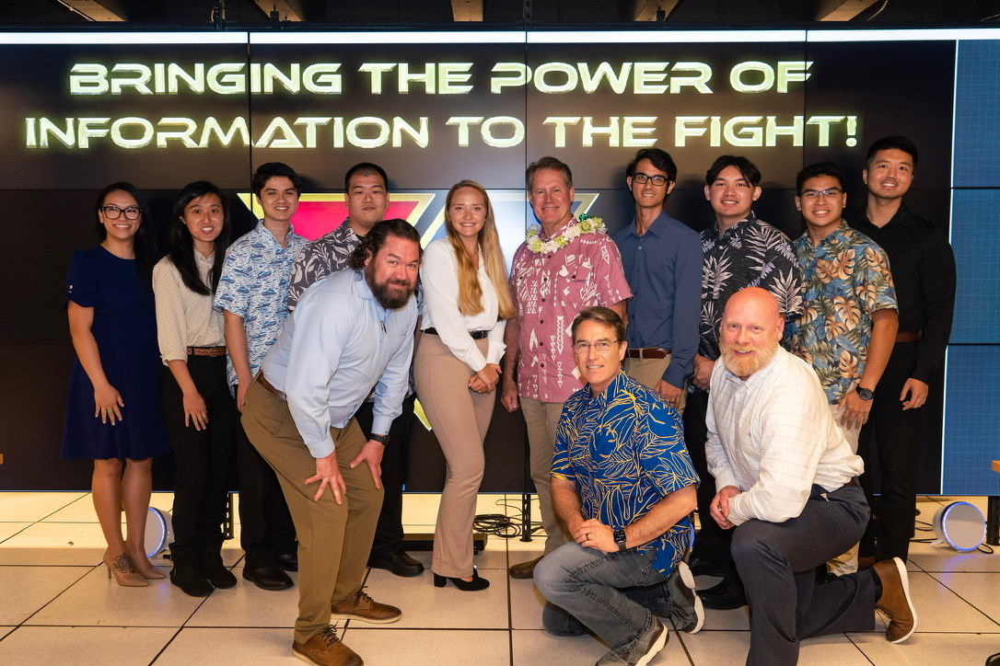
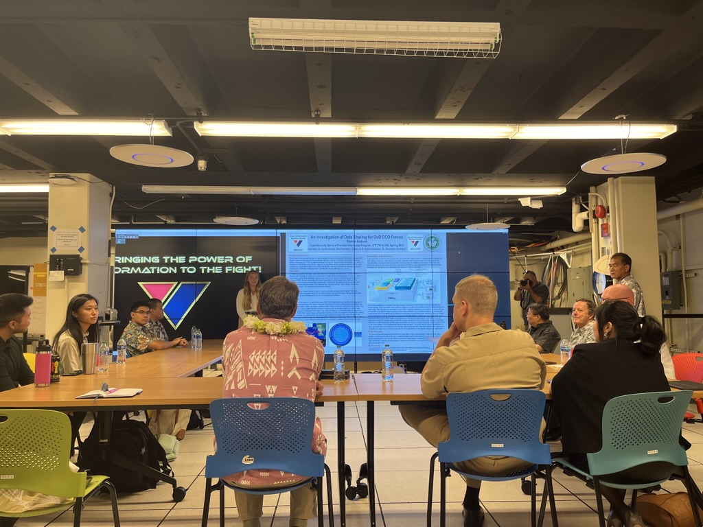
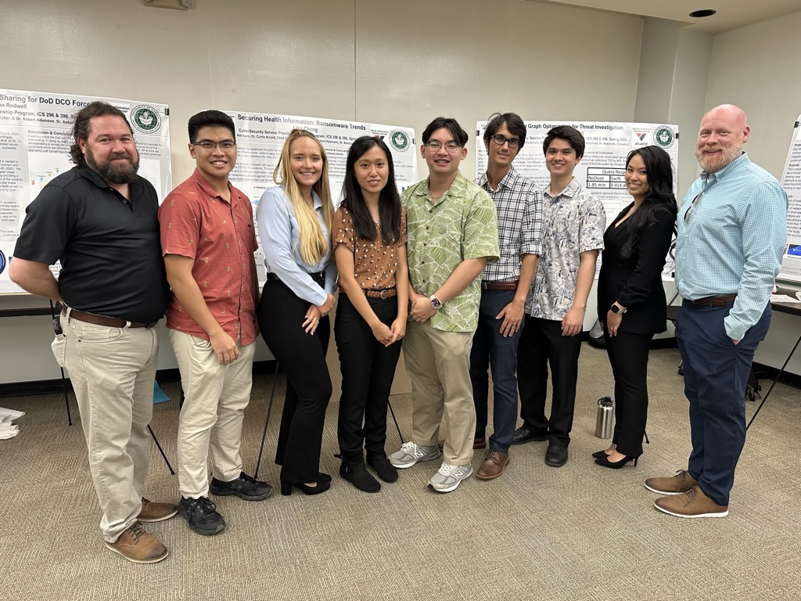
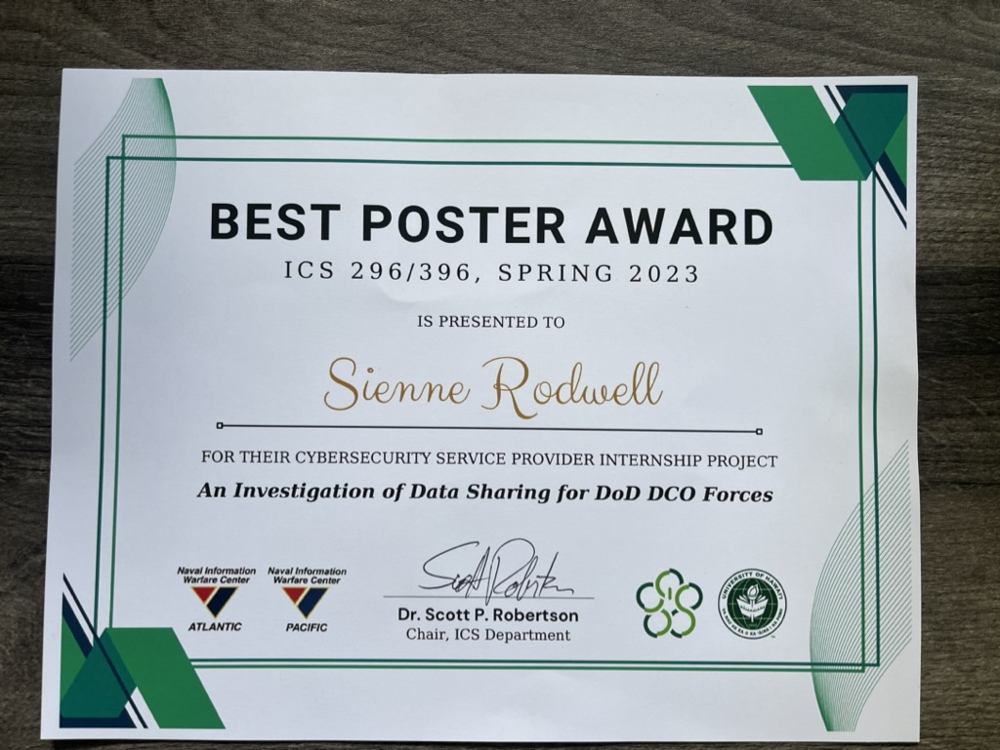

  
  
  
   

At the beginning of the semester, research was conducted to assess current issues within the DoD. After some research, it was found that the DoD has great difficulty with its data sharing capabilities. Throughout the semester, an intensive literature review as well as interviews with Subject Matter Experts (SMEs) were conducted. After completing an extensive research report, posters were created for presentation. Separate presentations had to be tailored for classmates, mentors, and government officials, including a Representative and a Senator. Learning outcomes included professional literature review, presentation creation, presenting with modifications for audience, and the writing of a detailed research report. 

In addition to the research on our chosen topic, the internship also had weekly lessons regarding an aspect of cybersecurity with a homework or discussion assignment. These topics included but were not limited to: DoD STIGS, RMF (risk management framework) policy reviews, examining network risk in terms of physical placement of dedicated firewalls, IPSs, IDSs, DMZs, and server placements, interpretation of configuration files from a security point of view, and other various risk analysis environments. I thoroughly enjoyed this learning experience. Moving forward I hope to expand my knowledge in as many aspects of cybersecurity as possible. Our work with network analysis and diagramming was also particularly interesting. 

[Click here for a link to a PDF of my research report](https://SienneR.github.io/projects/projectStuff/paperPDF.pdf)

[Click here for a link to a PDF of my poster](https://SienneR.github.io/projects/projectStuff/Poster.pdf)
