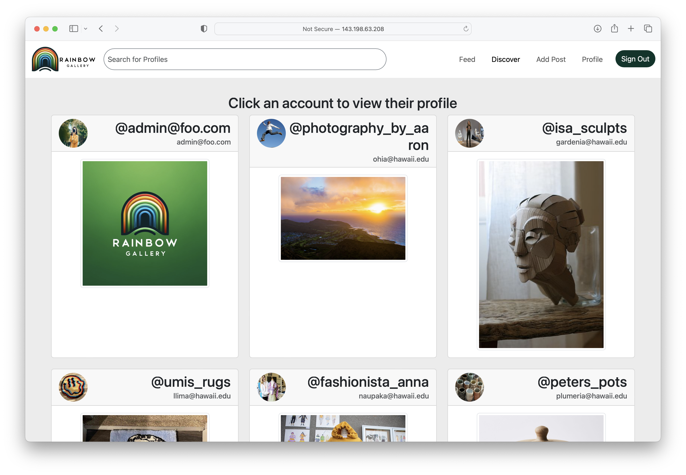

  
  
  

As a final project for a software development course, students were tasked to create an application that solved some issue within the University of Hawaii at Manoa student body. After consideration, our group decided to create a social media inspired application, which would provide artists with a platform to interactively share their art with others. The app has capabilities such as creating a profile, editing your profile, sharing posts, viewing the posts of others, searching for users, starring your favorite posts, following users to view their posts in your feed, and commenting on posts. My personal contributions to this group project include project management, profile capabilites, following capabilities, edit profile capabilities, the discover page, and more!

In order to create this app, we used many software development principals. We encorporated elements from React.js, Bootstrap, Meteor.js, MongoDB, and the JavaScript language. We encorporated [software design principals](https://sienner.github.io/essays/tessellation-for-creation.html) to create a well designed and intuitive application. We completed this application in less than one month as a group of four. Our app went through user testing from peers and artists in the UH community and received highly positive reviews. For more information, or to run our app on your local device, check out the links below!

[Learn more](https://rainbows-gallery.github.io/)

[View our organization on GitHub](https://github.com/rainbows-gallery)

