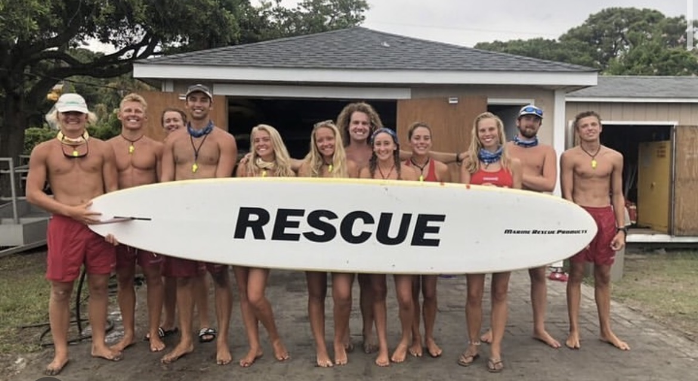
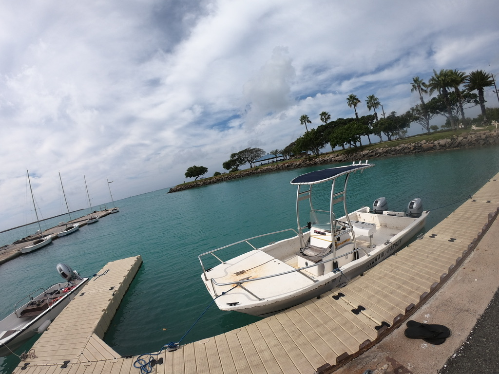
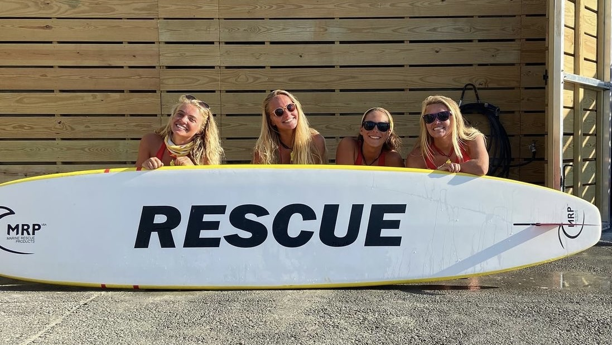
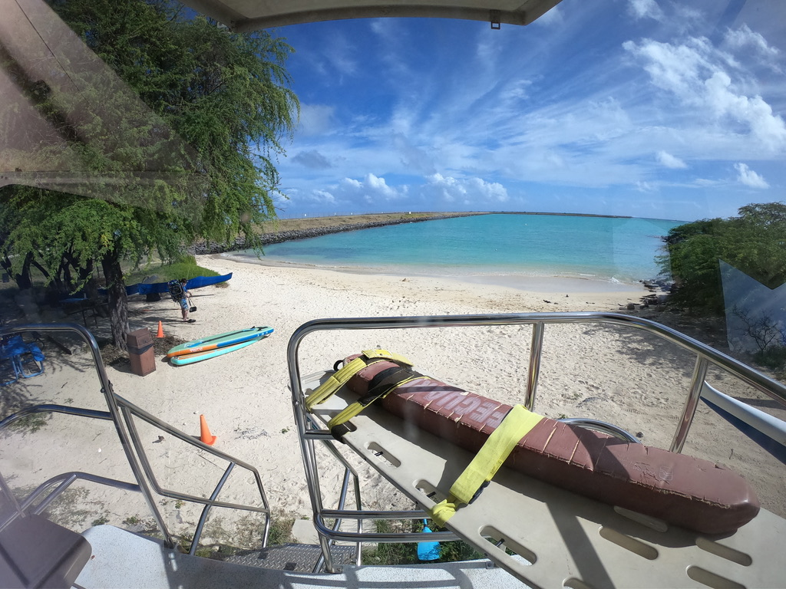
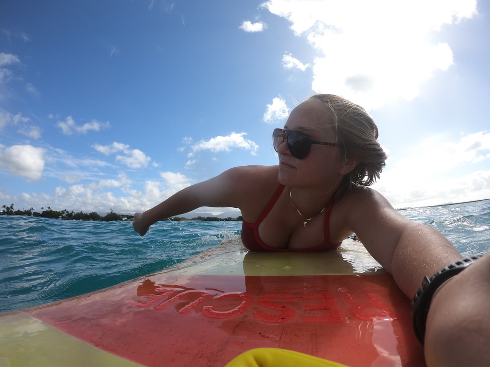

  
  
  
  
  
  

Growing up, I always wanted to be a beach lifeguard. As soon as I was old enough, I immediately began training for the entry tests. After months of hard work, I got the position! For the last 4 years, I have worked as an ocean rescue lifeguard in my spare time. Over the years, I've not only learned emergency response, gained USLA lifeguard certification, first-aid certification, and Emergency medical responder (EMR) certification, but developed communication skills, teamwork, and performance under pressure. Saving lives is a job that requires the ability for a prolonged attention span, quick response times, and rapid adaptability. 

I find it important to give back to my community, and have been lucky to find a place helping to save and keep safe the members of our community. Ocean Rescue has been a 4 year project, and I would be lucky to be able to continue working to help improve the community. Through the process I have learned how to manage time well, communicate effectively, work well in a team setting, and perform well under pressure and with little notice. I have also gained the ability to create rigorous training regimens and maintain progress towards a set goal. 

[United States Lifeguarding Agency](https://www.usla.org/)
